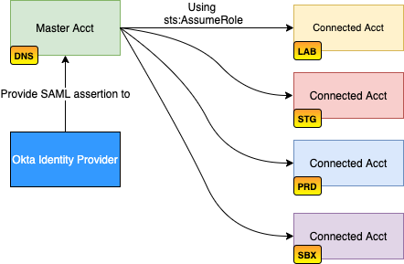
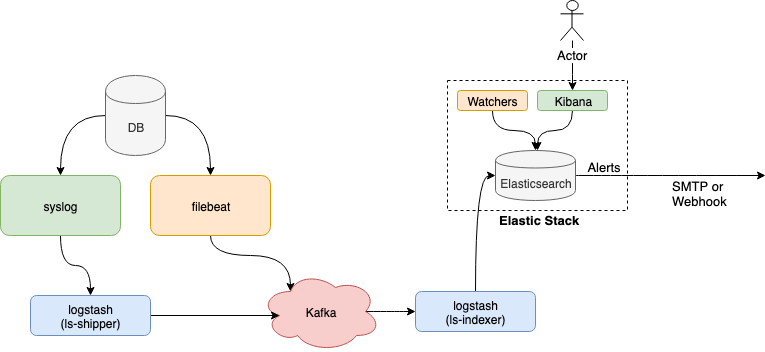

# Diagram Assets

## AWS Architecture Diagrams
- 
- 
- 

## Elastic Stack Architecture Diagrams
- 

## MySQL DB Query Logging to Elastic Stack Diagram
- 

## Triaging Problems
- [triaging_problems](triaging_problems)

## Docker Logging
- [Docker Logging](architecture/docker_logging.png)

